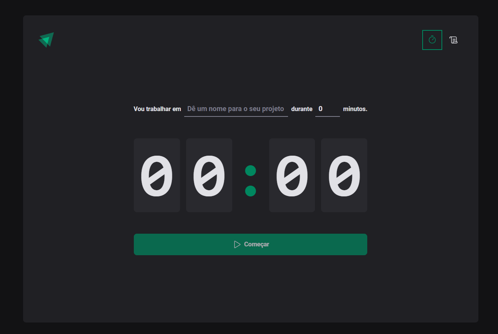
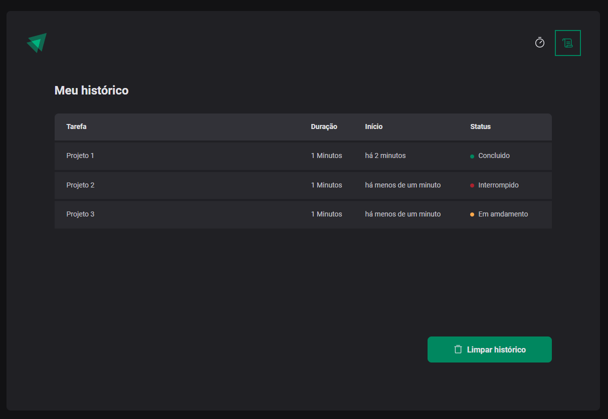

# Neewe feed [🔗Clique para acessar o projeto](https://main--neewe-feed.netlify.app/)

# > Projeto 2 Ignite

Projeto tipo pomodoro desenvolvido por meio do curso Ignite da Rocketseat e conta com meto de salvamento das tasks no localStorage.

## 🛠️ Tecnologias.

- React.js
- React Context
- React Hook Form 
- React Router DOM
- TypeScript
- immer
- localStorage
- CSS in JS
- Vite  
- Git e Github